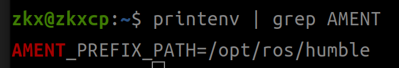

# 启程
    linux 中编写c++代码
    linux 中编写python代码
    linux 环境变量
## c++代码
用万能头还是要加std:: 

编译.cpp 时要在终端运行命令

    g++ 文件名

<u>记得要保存文件后运行</u> 

编译后会出现 a.out 文件  
运行a.out 后就是所输出内容
### cmake
新建文件名 CMakeLists.txt  
文件内容

    cmake_minimum_required(VERSION 3.8)
    project(取名)
    add_executable(将要生成的文件名 .cpp文件名)

终端中输入 `cmake .`

输入`make`

生成learn_cmake文件

输入`./ learn_cmake`即可运行
## 环境变量
`echo ` 打印后面内容

`$` 打印存储在其中内容

`echo $ROS_DISTRO`打印ros版本号

运行`ros2 run turtlesim turtlesim_mode`
`printenv`查询当前环境变量
如何找到功能包与可执行文件呢？
> 1.AMENT_PREFIX_PATH  
> 2.lib/package_name/exacuteable_name

  
拼接后路径为/opt/ros/humble/lib/turtlesim/turtlesim_node

 